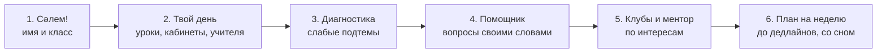
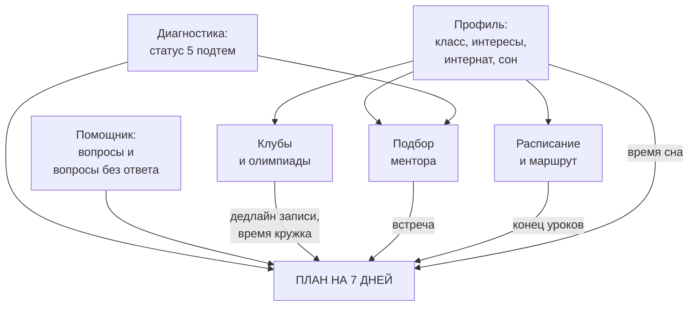
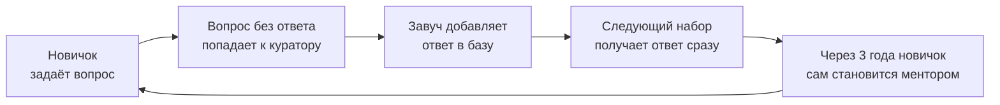

# Компас семиклассника · команда Astra

Текст для презентации по шаблону Astra (8 слайдов) + сценарий защиты на 5 минут + разбор по критериям жюри.

> **Как читать этот файл**
> - `[ВСТАВИТЬ: …]`: место для ваших данных (интервью, опрос, имена). Цитаты и цифры придумывать нельзя: жюри из учителей это заметит.
> - `[ПРОВЕРИТЬ: …]`: цифра взята из открытых источников или посчитана по допущению. Перед защитой сверьте её.
> - Схемы в формате mermaid показываются на GitHub как картинки. Для слайдов их можно перерисовать в Canva в том же стиле, что EduWave.
>
> Живой сайт: **https://compass7-nis.vercel.app**

---

## Слайд 1. Обложка

**Логотип:** Astra (слева вверху, как в шаблоне)

**Подзаголовок сверху:**
Адаптационная система для семиклассников НИШ: диагностика, помощник, маршрут, менторы и план первой недели

**Название (крупно):** **Компас.** *(вариант: «Компас 7»)*

**Слоган:** Сәлем, НИШ! Первая неделя без паники.
*(каз.: Жаңа мектеп. Жаңа мүмкіндік. Жоспар дайын.)*

**Три плашки (как «Цель запуска / Стратегия роста / Бюджет запуска»):**

| Цель пилота | Стратегия роста | Бюджет пилота |
|---|---|---|
| **100%** семиклассников одной школы в первую неделю | **Через кураторов и менторов** | **≈ 100K ₸** |

**Справа:** скриншот телефона с экраном «Сәлем, Айгерим!» и блоком «Твой день» (уроки, кабинеты, учителя).

---

## Слайд 2. Проблема

**Заголовок:**
**Отличник вчера, «тройка» сегодня.** Новичок в НИШ проигрывает не знаниям, а новой системе.

**Текст под заголовком:**
В 7 класс НИШ приходят по вступительным экзаменам, часто лучшие ученики своих школ. Но в первые недели на них одновременно обрушиваются:
- новая система оценивания (ФО, СОР, СОЧ, дескрипторы вместо привычных оценок);
- кабинетная система: 7 уроков, и каждый в другом кабинете и на другом этаже;
- три языка обучения;
- десятки клубов и олимпиад без понятной навигации;
- для многих ещё и интернат.

Информация есть, но она разбросана: сайт, чаты, электронный журнал, куратор. **Ученик не знает, что важно сейчас, а что потом.**

**Три карточки с цифрами (как «4+ млн / +6% / 95,4 млрд»):**

| Карточка | Цифра | Подпись | Источник |
|---|---|---|---|
| 1 | **≈ 40%** | учеников не показывают ожидаемого прогресса в год после перехода в новую школу | Galton, Gray & Ruddock, 1999 (исследование перехода между школами, Великобритания) `[ПРОВЕРИТЬ: формулировку и год]` |
| 2 | **[ВСТАВИТЬ: X из Y]** | учителей НИШ считают, что новичкам в первые недели сложно из-за системы, а не из-за знаний | Опрос учителей, 25.09.2026 |
| 3 | **10 этажей и 3 далёких перехода** | за один понедельник у ученика 7B (наш пример расписания: 7 уроков в 7 разных кабинетах на 4 этажах) | Расчёт Компаса на примере расписания |

**Справа вместо графика «Насколько эффективны методы обучения»:**
столбчатая диаграмма по результатам вашего опроса: «Что сложнее всего новичку?» (система оценивания / кабинеты / языки / клубы / интернат) `[ВСТАВИТЬ: результаты опроса]`.

**Блок «Голос школы»** (на этом слайде или отдельной плашкой):
> «[ВСТАВИТЬ: дословная цитата]»
> **Айдана Тулегеновна**, заместитель директора по учебной работе `[ПРОВЕРИТЬ: должность и школа]`

---

## Слайд 3. Рынок и аудитория

**Заголовок:** MARKET & TARGET AUDIENCE

**Слева крупно:** ОТБОР УЖЕ ЕСТЬ. СИСТЕМЫ АДАПТАЦИИ ПОСЛЕ ОТБОРА ПОКА НЕТ.

**Текст:**
Каждый год в НИШ и другие школы с вступительными экзаменами приходят тысячи новых учеников. Школы тратят много сил на отбор, но адаптация после поступления держится на кураторе и на том, повезёт ли ученику со старшими друзьями.

**Тёмный блок из трёх колонок:**

| MARKET SIZE | TARGET USER | MARKET GAP |
|---|---|---|
| ① **20+ школ НИШ** в городах Казахстана `[ПРОВЕРИТЬ: точное число школ]` | **Основные пользователи:** семиклассники-новички, 12–13 лет | Сайт школы, чаты и электронный журнал **хранят** информацию, но не **объясняют** её новичку и не превращают в план. |
| ② **[ПРОВЕРИТЬ: сколько учеников принимают в 7 класс НИШ в год]** | **Вторые:** кураторы и завучи (видят, что непонятно новичкам) | Компас собирает всё в один маршрут: проверить знания → задать вопрос → получить план на неделю. |
| ③ Школы с отбором: **БИЛ (КТЛ), РФМШ, специализированные лицеи** `[ПРОВЕРИТЬ: названия сетей]` | **Партнёры:** школы, менторы-старшеклассники, родители | |

---

## Слайд 4. Как работает Компас

**Заголовок:** Как работает Компас?

**Три экрана телефона с подписями (как School League / AI Coach / Portfolio):**

| Экран | Подпись в кавычках |
|---|---|
| **Диагностика** (таблица подтем со статусами) | «Показывает не процент, а конкретные слабые темы» |
| **Помощник** (ответ + «Совпали слова») | «Отвечает на вопрос своими словами на русском и казахском» |
| **План на 7 дней** (день по часам) | «Ставит задачи до дедлайна и не трогает сон» |

**Текст слева:**
Компас превращает первую неделю в НИШ в **понятный маршрут**. Ученик вводит имя и класс, и сайт сам показывает его день: уроки, кабинеты, этажи, учителей и куратора.

Дальше три связанные функции:
1. **Диагностика** находит слабые подтемы по математике.
2. **Помощник** отвечает на вопросы о школе и запоминает, что ученику непонятно.
3. **Планер** собирает всё в расписание на неделю: занятия по слабым темам до СОР, дела у куратора, запись в кружки, встречу с ментором. И всё это с учётом уроков, отдыха и сна.

**Пять шагов внизу (как Create Profile → … → Build Portfolio):**

**Схема «как данные связаны» (для вопроса жюри «функции правда связаны?»):**

---

## Слайд 5. Услуги и модель (вместо «Услуги & Монетизация»)

**Заголовок:** Услуги и модель

**Подзаголовок:** Для ученика Компас всегда бесплатный. Платит школа, потому что получает то, чего у неё сейчас нет: данные о том, где новичкам трудно.

**Четыре плашки слева (01–04):**
- **01. Компас для ученика: 0 ₸.** Диагностика, помощник, маршрут, клубы, ментор, план.
- **02. Компас для школы (лицензия).** Загрузка реального расписания и базы ответов, анонимная статистика: какие темы и вопросы чаще всего непонятны новичкам.
- **03. Программа менторов.** Старшеклассники-менторы получают сертификат волонтёрства и часы в портфолио.
- **04. Сеть школ.** Общая база ответов для НИШ и других школ с отбором, у каждой школы свои правила.

**Таблица (как Free vs Pro):**

| Возможность | Ученик (бесплатно) | Школа (лицензия) |
|---|---|---|
| Диагностика, помощник, план | ✔ Доступно | ✔ Доступно |
| Расписание и маршрут | Примерное | ✔ Реальное расписание школы, загрузка из таблицы |
| База ответов помощника | Общая | ✔ Правила своей школы, редактирует завуч |
| Статистика «что непонятно новичкам» | ✖ | ✔ Анонимно, по классам, без имён |
| Результаты диагностики по параллели | ✖ | ✔ Средние по подтемам, для учителей математики |
| Менторы | Подбор | ✔ Управление программой менторов |

**Цикл справа (вертикальные стрелки, как «Бесплатные пользователи → … → Доход»):**
Ученики бесплатно → Вопросы и результаты (анонимно) → Школа видит проблемные места → Лицензия школы → Новые функции → Ещё больше учеников.

---

## Слайд 6. Как Компас дойдёт до каждого семиклассника

**Заголовок:** Как Компас охватит 100% новичков?

**Подзаголовок:** Мы не рекламируем Компас. Его выдают в первый день вместе с расписанием.

**Три колонки (как Captains / League / Sharing):**

**① Кураторский час в первый день**
Куратор показывает QR-код на классном часе, и каждый новичок заполняет профиль за 2 минуты.
Расчёт: `4 класса × 25 учеников = 100 новичков` `[ПРОВЕРИТЬ: сколько 7 классов и учеников в вашей школе]` → **90% регистрируются на уроке = 90 учеников**.

**② Менторы-старшеклассники**
1–2 ментора на класс (10–11 класс, президенты клубов, олимпиадники) помогают пройти диагностику и задать первые вопросы.
Расчёт: `90 активных × 80% проходят диагностику за 48 часов` → **72 ученика с персональным планом**.

**③ Родители и чат класса**
Скачанный план `.txt` ученик отправляет родителям, и родители видят, как устроена неделя.
Расчёт: `72 плана × 50% делятся` → **36 семей понимают систему НИШ с первой недели**.

**График внизу (вместо «Рост MAU по неделям»):**
Охват по неделям пилота: неделя 1: 90 → неделя 2: 100% (догоняют пропустившие) → неделя 4: повторная диагностика перед СОЧ.

**Масштабирование:**

| Этап | Когда | Охват |
|---|---|---|
| Пилот | 1-я четверть 2026–2027 | 1 школа, все 7 классы |
| Расширение | 2027–2028 | 5 школ НИШ `[ПРОВЕРИТЬ]` |
| Сеть | 2028+ | школы НИШ и другие школы с отбором |

---

## Слайд 7. Финансовый план и реалистичность

**Заголовок:** Финансовый план & Реалистичность

> Все цены ниже **допущения**. Сверьте их перед защитой: курс доллара, стоимость печати и домена.

**Таблица 1. Бюджет пилота (1 школа, 1 четверть)**

| Статья расходов | Назначение | Сумма (₸) |
|---|---|---|
| Хостинг | Vercel: сайт уже работает бесплатно на тарифе Hobby. Для официального запуска в школе нужен тариф Pro: $20/мес × 3 мес `[ПРОВЕРИТЬ: курс, ≈ 500 ₸/$]` | 30 000 |
| Домен | например `compass7.kz`, 1 год `[ПРОВЕРИТЬ цену]` | 10 000 |
| Печать | QR-постеры в кабинеты и памятки для кураторов | 20 000 |
| Программа менторов | сертификаты и значки для 8 менторов | 20 000 |
| Резерв | непредвиденные расходы | 20 000 |
| **ИТОГО** | **максимальная инвестиция в пилот** | **100 000** |

**Таблица 2. Доход со 2-го года (лицензии школ)**

| Источник дохода | Метрика / расчёт | Сумма в год (₸) |
|---|---|---|
| Лицензия школы | 5 школ × 200 000 ₸/год `[допущение]` | 1 000 000 |
| Сеть школ (общая база ответов) | 1 договор с сетью × 300 000 ₸ `[допущение]` | 300 000 |
| **ИТОГО** | прогнозируемый годовой доход | **1 300 000** |

**Расходы 2-го года:** хостинг Pro ~120 000 ₸ + домен 10 000 ₸ + печать для 5 школ 100 000 ₸ + менторы 100 000 ₸ = **~330 000 ₸**.

**Вывод:** пилот стоит ~100 000 ₸. Со второго года 5 лицензий покрывают расходы примерно в 4 раза. Для ученика Компас остаётся бесплатным.

**Круговая диаграмма (как 59,5% / 32,4% / 8,1%):**
Структура дохода 2-го года: лицензии школ **77%** (1 000 000), сеть школ **23%** (300 000).

**Что уже сделано бесплатно (сильный аргумент реалистичности):**
Прототип написан за хакатон, работает на бесплатном хостинге и не требует сервера и базы данных. Цена первого запуска для школы: **0 ₸**.

---

## Слайд 8. Почему Компас победит

**Заголовок:** Почему Компас победит?

**Подзаголовок:** Мы не просто показываем расписание. Мы превращаем первую неделю новичка в понятный план.

**Блок 1. Растёт сам (вместо Viral by Design).**
Каждый вопрос новичка делает Компас умнее для следующего набора.

**Блок 2. Сравнение (вместо таблицы Traditional EdTech vs EduWave):**

| Что нужно новичку | Сайт школы | Чат класса | Электронный журнал | **Компас** |
|---|---|---|---|---|
| Расписание с кабинетами и этажами | частично | ✖ | ✔ | ✔ + маршрут |
| Объяснение ФО / СОР / СОЧ простыми словами | ✖ | как повезёт | ✖ | ✔ на RU и KZ |
| Какие темы подтянуть | ✖ | ✖ | ✖ | ✔ по подтемам |
| Клубы по интересам без пересечений | список | ✖ | ✖ | ✔ |
| План недели с дедлайнами и сном | ✖ | ✖ | ✖ | ✔ |
| Работает без интернета | ✖ | ✖ | ✖ | ✔ файл `index.html` |

**Блок 3. Реалистичный запуск (вместо Sustainable Business, 5 ступенек):**
Прототип работает → Пилот в одной школе → Реальное расписание и база ответов → 5 школ → Сеть школ с отбором.

---

# Интервью и опрос: что вставить в слайды

## Интервью с завучем: Айдана Тулегеновна

Запишите ответы **дословно** и спросите разрешение на цитату. Лучше 3 вопроса, чем 7.

1. С какими трудностями чаще всего сталкиваются семиклассники в первые недели?
2. Бывает, что сильный ученик из обычной школы сначала резко теряет в оценках? С чем вы это связываете?
3. Какие вопросы новички задают кураторам чаще всего?
4. Если бы у школы была анонимная статистика «что непонятно новичкам», как бы вы её использовали?
5. Что должно быть в таком сервисе, чтобы школа им реально пользовалась?

**Куда вставить:**
- ответ на 1 или 2 → слайд 2 «Голос школы»;
- ответ на 4 → слайд 5 (польза лицензии для школы);
- ответ на 5 → слайд 8 или «Следующий шаг».

## Опрос учителей (завтра)

Короткий, 5 вопросов, в Google Forms. Результаты превратите в диаграмму на слайде 2.

1. Сколько лет вы работаете с 7 классами? (до 3 / 3–10 / больше 10)
2. Что сложнее всего новичку в первые недели? (можно несколько: система оценивания, кабинеты, языки, клубы, интернат, нагрузка)
3. Замечаете ли вы, что сильные новички сначала получают более низкие результаты? (часто / иногда / редко)
4. Полезна ли была бы учителю анонимная статистика по слабым темам новичков? (да / скорее да / нет)
5. Одним предложением: что бы вы посоветовали новичку?

**Как показать на слайде:** «Опрошено [N] учителей. [X]% отметили систему оценивания как главную трудность».

---

# Защита: 5 минут

## 0:00–1:00. Проблема и пользователь

> «Представьте Айгерим. В своей школе она была лучшей по математике и поступила в НИШ. В первый же понедельник у неё 7 уроков в 7 разных кабинетах на 4 этажах, три незнакомые аббревиатуры (ФО, СОР, СОЧ), 13 кружков и олимпиад на выбор и первая СОР через неделю. Знаний хватает, но она не понимает, что делать первым. [Цитата Айданы Тулегеновны.] Наш продукт для новичков 7 класса: Компас превращает первую неделю в понятный план».

## 1:00–4:00. Демонстрация

| Время | Что делаем | Что говорим |
|---|---|---|
| 1:00 | Открываем `compass7-nis.vercel.app`, нажимаем «Бастайық / Начнём» | «Сайт на двух языках, работает на телефоне». |
| 1:10 | **Ошибочная ситуация:** жмём «Сохранить» на пустой анкете | «Проверка ввода: видно, что именно исправить». |
| 1:25 | Заполняем: Айгерим, 7B, интересы, сон 22:30–06:30 | «Ввели только имя и класс, а расписание, кабинеты и учителя подставились сами». |
| 1:45 | Диагностика: вводим «пятнадцать» в числовой вопрос, потом правильно | «Ещё одна проверка. Результат по подтемам: проценты требуют внимания». |
| 2:20 | Помощник: «я болел и не написал соч, что теперь будет?» | «Такой фразы в базе нет, но помощник нашёл ответ и показал, по каким словам. Это не чёрный ящик». |
| 2:45 | Клубы: пробуем добавить изостудию к робототехнике | «Пересекаются по времени, Компас предупреждает». |
| 3:05 | Ментор: Алан, 9 баллов, причины | «Подбор по интересам, слабым темам и интернату». |
| 3:25 | План: показываем четверг и пятницу | «Два занятия по процентам в разные дни, до СОР, после 21:30 задач нет. Сон не трогаем». |
| 3:50 | «Скачать .txt» | «План можно отправить родителям». |

## 4:00–5:00. Результат

> «Без Компаса новичок тратит первые недели на то, чтобы разобраться в системе. С Компасом он в первый же день знает свой маршрут, слабые темы и план.
> Мы провели [4+] теста, включая ошибочный ввод и граничные случаи; все пройдены, плюс 13 автотестов.
> Вклад: [ВСТАВИТЬ: 4 имени и роли].
> Ограничения: расписание и ответы пока примерные, диагностика только по математике.
> Следующий шаг: пилот в нашей школе с реальным расписанием и базой ответов от завуча».

---

# Разбор по критериям жюри (100 баллов)

Для каждого показателя: чем мы его закрываем и где это показать.

## 1. Проблема и польза (15)

| Показатель | Чем закрываем | Где показать |
|---|---|---|
| Проблема и пользователь определены | Новичок 7 класса НИШ, первые недели, новая система | Слайд 2, первая минута |
| Сценарий соответствует потребностям | Имя и класс → твой день → слабые темы → ответы → план | Демо целиком |
| Польза на примере или сравнении | Айгерим «до/после»; таблица сравнения с сайтом, чатом, журналом; цитата завуча; опрос | Слайды 2 и 8 |

## 2. Работоспособность (30)

| Показатель | Чем закрываем |
|---|---|
| Функция 1 работает | Диагностика: 10 задач, результат по 5 подтемам |
| Функция 2 работает | Помощник: свободный текст RU/KZ, 21 ответ, поиск по корням слов с весами |
| Функция 3 работает | План: приоритеты + неделя по часам |
| Целостный сценарий | Результаты 1 и 2 реально попадают в 3 (схема на слайде 4) |
| Правильная обработка | Тест 1: 6 из 10 с верными статусами; план до дедлайнов, 0 не поместилось |
| Запуск и повтор | Онлайн-ссылка + `index.html` без интернета; «Начать заново» |

## 3. Надёжность и тестирование (20)

| Показатель | Чем закрываем |
|---|---|
| Пустой и некорректный ввод | Пустая анкета, цифры в имени, пустой ответ, «пятнадцать» вместо числа, пустой вопрос, «??» |
| Граничные ситуации | 3-й кружок (лимит 2), пересечение по времени, сон 7 ч (предупреждение), все ответы верны, вопрос вне базы, план до диагностики |
| 4 теста с ожидаемым и фактическим | `TESTS.md`: 4 основных + 10 дополнительных + 13 автотестов |
| Понятные сообщения | Каждое говорит, что исправить: «Нужно число, например 12, −3 или 2,5» |

## 4. Удобство интерфейса (15)

| Показатель | Чем закрываем |
|---|---|
| Понятно назначение и порядок | Главная с шагами 1–6 и меткой «Следующий шаг» |
| Читаемость, статус не только цветом | Иконка + текст + цвет (✓ Тема закрыта / ◐ Повторить / ⚠ Требует внимания), тёмная тема, телефон |
| Подтверждение действия | «В плане», «Файл сохранён», «План скопирован», статусы разделов на главной |

## 5. Обоснованность решения (10)

| Показатель | Чем закрываем |
|---|---|
| Выбор функций и технологий | Три функции идут по пути новичка: знания → вопросы → план. Чистый HTML/JS: без сервера, бесплатно, работает офлайн, код можно объяснить |
| Особенность под школу | Автоподстановка расписания по классу, СОР/СОЧ, кабинетная система, интернат, трёхъязычие, менторы-старшеклассники, сон школьника |

## 6. Защита и командная работа (10)

| Показатель | Чем закрываем |
|---|---|
| Демо и ответы на вопросы | Сценарий по таймингу выше; ответы на частые вопросы ниже |
| Вклад и источники | Слайд «Команда» + раздел «Источники» |

---

# Вопросы жюри: подготовленные ответы

**«Где здесь ИИ?»**
«Мы сознательно не использовали нейросеть внутри продукта: по условиям она не даёт баллов, а нам важно объяснить каждый результат. Помощник ищет ответ по совпадению корней слов, и редкие слова весят больше. На экране видно, какие слова совпали. ИИ (Claude) мы использовали как помощника при написании кода и указали это в источниках».

**«Как вы проверяли, что план правильный?»**
«Автотест проверяет, что два занятия одной темы стоят в разные дни, все задачи идут до 21:30 при отбое в 22:30, запись в кружок до дедлайна, а встреча с ментором не в день кружка».

**«Данные настоящие?»**
«Нет, по условиям мы использовали вымышленные данные: расписание, учителя, менторы. Для пилота школа загрузит своё расписание».

**«Чем это лучше куратора?»**
«Мы не заменяем куратора, мы его разгружаем. Типовые вопросы закрывает помощник, а нетиповые попадают в план как “спроси у куратора”, чтобы ученик не стеснялся спросить».

**«Что будет, если нет интернета?»**
«Сайт работает из одного файла `index.html` без интернета, данные сохраняются в браузере».

---

# Команда и источники (последний слайд)

| Участник | Роль | Что сделал |
|---|---|---|
| [ВСТАВИТЬ] | Капитан, продукт | Проблема, сценарий, интервью с завучем |
| [ВСТАВИТЬ] | Разработка: логика | Диагностика, помощник, планер |
| [ВСТАВИТЬ] | Разработка: интерфейс | Экраны, дизайн, RU/KZ |
| [ВСТАВИТЬ] | Тестирование и исследование | Тесты, опрос учителей, презентация |

**Источники и инструменты:**
- Claude Code (ИИ-ассистент Anthropic): помощь в написании кода, проверка в браузере. Команда разобрала и может объяснить весь код.
- Шрифты Golos Text, Unbounded, JetBrains Mono (Google Fonts, лицензия OFL).
- Хостинг Vercel (бесплатный тариф).
- Исследование о переходе между школами: Galton, Gray & Ruddock, 1999 `[ПРОВЕРИТЬ]`.
- Интервью: Айдана Тулегеновна `[ПРОВЕРИТЬ должность]`; опрос учителей, 25.09.2026.
- Все данные в прототипе вымышленные.
